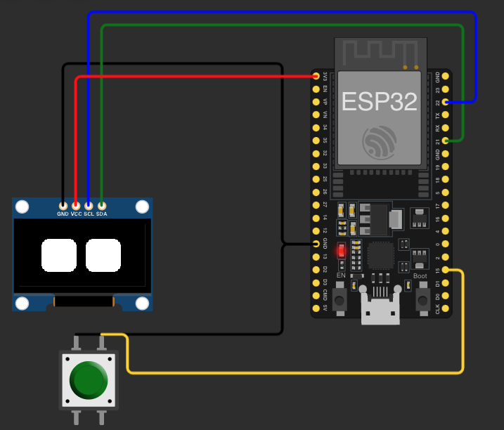

# Robot Learning System with Q-Learning and OLED Expressions



## Overview
This project is a reinforcement learning-based robot running on an **ESP32 WROOM-32**. The robot uses **Q-learning** to adapt its **facial expressions** (displayed on an **SSD1306 OLED screen**) and **physical behaviors** based on sensor data from **a light sensor and an audio sensor**. A **button** allows the user to reinforce preferred behaviors, helping the robot learn how to react appropriately to different environmental conditions.

## Features
✅ **FreeRTOS Multitasking** – Handles sensors, learning, actions, and user feedback independently.  
✅ **Q-Learning AI** – Allows the robot to learn expressions and behaviors over time.  
✅ **User Reinforcement Button** – Pressing a button rewards desired behaviors, improving learning.  
✅ **OLED Robo Eyes Expressions** – The robot displays expressions like **happy, angry, tired, and default**.  
✅ **Sensor-Based Decision Making** – The robot reacts dynamically based on **light and sound levels**.  
✅ **Persistent Learning** – Uses **EEPROM** to store the Q-table, allowing the robot to retain behaviors after reboot.  
✅ **Improved Action Selection** – Now uses a **50% exploration, 50% exploitation** strategy for more balanced learning.  
✅ **Last Action Reinforcement** – The system now remembers the last meaningful action (excluding default) for button reinforcement.  
✅ **Prevents Action Repetition** – Penalizes repetitive actions to encourage diversity in behavior selection.  

## Hardware Requirements
- **ESP32 WROOM-32** (or compatible microcontroller)
- **SSD1306 OLED Display (I2C, 128x64 pixels)**
- **Light Sensor (Analog, e.g., LDR)**
- **Audio Sensor (Analog, e.g., KY-038 or MAX9814)**
- **Push Button (for reinforcement feedback)**

## Software Requirements
- **Arduino IDE** with ESP32 board support
- **FreeRTOS** (included in ESP32 framework)
- **Adafruit SSD1306 & GFX Library** (for OLED display)
- **FluxGarage RoboEyes Library** (for animated eyes)
- **EEPROM Library** (for storing Q-table)

## How It Works
1. **Sensor Input Processing:** The ESP32 continuously reads data from the **light sensor** and **audio sensor**, categorizing them into discrete states.
2. **Q-Learning Decision Making:**
   - The robot now selects an action using a **50% exploitation, 50% exploration** approach, ensuring more balanced learning.
   - Previously, it was biased toward known actions (90% exploitation), which caused stagnation.
3. **Expression Display on OLED:** The robot expresses different moods:
   - **Tired** (Low energy, low sensor input)
   - **Angry** (Loud noise or sudden change in brightness)
   - **Happy** (Stable, bright environment with moderate sound)
   - **Default** (Neutral state)
4. **User Feedback Mechanism:**
   - If the user **presses the button**, the robot assigns a **high reward** to the last meaningful action (not default), reinforcing that behavior.
   - **New Fix:** The robot now **remembers the last non-default action** to avoid missing reinforcement opportunities.
5. **Prevents Repetitive Actions:**
   - If the same action is repeated **too many times in a row**, its Q-value is **slightly reduced** to encourage exploration.
6. **Persistent Learning:** The robot saves learned behaviors to **EEPROM**, ensuring the Q-table remains even after a reboot.

## FreeRTOS Task Structure
| Task | Function |
|------|----------|
| **TaskReadSensors** | Reads light/audio sensor and updates state. |
| **TaskDecisionMaking** | Selects the best action using Q-learning. |
| **TaskPerformAction** | Displays the selected expression on the OLED screen. |
| **TaskUpdateDisplay** | Ensures continuous OLED updates without blocking other tasks. |
| **TaskUserFeedback** | Detects button press and reinforces behaviors based on last meaningful action. |

## Improvements Made
- **Balanced Exploration & Exploitation (50% - 50%)** to prevent predictable behavior.
- **Last Action Reinforcement Fix** ensures proper reinforcement even when the bot returns to default state.
- **Prevention of Repetitive Actions** by applying a small penalty to overly frequent selections.
- **OLED Update Task** now runs continuously with optimized performance.
- **Debugging Improvements** – Added serial output for action tracking and reinforcement logs.

## Future Improvements
- **Motor Integration:** Move arms based on learned behaviors.
- **Wi-Fi Logging:** Send learning data to a remote dashboard.
- **Additional Sensors:** Include proximity or temperature sensing for richer interaction.
- **Pretrained Models:** Use a hybrid approach with a pre-trained behavior model.

## How to Use
1. **Flash the firmware onto the ESP32 using Arduino IDE.**
2. **Power up the ESP32 and allow it to start learning from its environment.**
3. **Observe the OLED screen for changing facial expressions.**
4. **Press the button when the robot reacts correctly to encourage the behavior.**
5. **Let the robot learn over time—its reactions will improve based on reinforcement!**

---
### 📌 This project demonstrates a simple yet powerful reinforcement learning system on an ESP32 using FreeRTOS and an OLED display. 🚀

---

Modify the FluxGarage_RoboEyes.h file to use an extern reference to display. This allows it to recognize the display object from sketch.ino.

Add this line at the top of the FluxGarage_RoboEyes.h file (after the #ifndef guard):

```
extern Adafruit_SSD1306 display;
```